[事件循环1]
================
JavaScript 是一门单线程的脚本语言。所谓单线程，就是指所有的任务都需要排队一个个执行，只有前一个任务执行完了才可以执行后一个任务。这就造成了一个问题，如果前一个任务耗时过长，则会阻塞下一个任务的执行，在页面上用户的感知便会是浏览器卡死的现象；

而由于在大部分的情况中，造成任务耗时过长不是任务本身计算量大而导致 CPU 处理不过来，而是因为该任务需要与 IO 设备交互而导致的耗时过长，但这时 CPU 却是处于闲置状态的。所以为了解决这个问题，便有了本章节的 JavaScript（也可以说是浏览器的）事件循环（Event Loop）机制
在 JavaScript 事件循环机制中，使用到了三种数据对象，分别是栈（Stack）、堆（Heap）和队列（Queue）。

> 栈：**一种后进先出（LIFO）的数据结构。可以理解为取乒乓球时的场景，后面放进去的乒乓球反而是最先取出来的**。

> 堆：**一种树状的的数据结构。可以理解为在图书馆中取书的场景，可以通过图书索引的方式直接找到需要的书**。

> 队列：**一种先进先出（FIFO）的数据结构。即我们平时排队的场景，先排的人总是先出队列**。

在 JavaScript 事件循环机制中，使用的栈数据结构便是执行上下文栈，**每当有函数被调用时，便会创建相对应的执行上下文并将其入栈**；**使用到堆数据结构主要是为了表示一个大部分非结构化的内存区域存放对象**；**使用到的队列数据结构便是任务队列，主要用于存放异步任务**

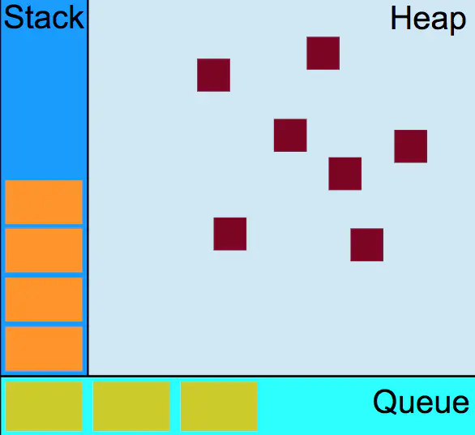

执行上下文栈
在 JavaScript 代码运行过程中，会进入到不同的执行环境中，一开始执行时最先进入到全局环境，此时全局上下文首先被创建并入栈，之后当调用函数时则进入相应的函数环境，此时相应函数上下文被创建并入栈，当处于栈顶的执行上下文代码执行完毕后，则会将其出栈。这里的栈便是执行上下文栈。
举个例子～

```javascript
function fn2() {
    console.log('fn2')
}
function fn1() {
    console.log('fn1')
    fn2();
}

fn1();

```
任务队列
在 JavaScript 事件循环机制中，存在多种任务队列，其分为宏任务（macro-task）和微任务（micro-task）两种。

> **宏任务包括：setTimeout、setInterval、I/O、UI rendering**
> **微任务包括：process.nextTick、Promise、Object.observe（已废弃）、MutationObserver（html5新特性）**

上述所描述的 setTimeout、Promise 等都是指一种任务源，其对应一种任务队列，真正放入任务队列中的，是任务源指定的异步任务。在代码执行过程中，遇到上述任务源时，会将该任务源指定的异步任务放入不同的任务队列中。
不同的任务源对应的任务队列其执行顺序优先级是不同的，上述宏任务和微任务的先后顺序代表了其任务队列执行顺序的优先级。
即在宏任务队列中，各个队列的优先级为
**setTimeout > setInterval > I/O**
在微任务队列中，各个队列的优先级为
**Promise > Object.observe > MutationObserver**
对于 UI rendering 来说，浏览器会在每次清空微任务队列会根据实际情况触发，这里不做详细赘述。
事件循环机制流程

> 主线程执行 JavaScript 整体代码，形成执行上下文栈，当遇到各种任务源时将其所指定的异步任务挂起，接受到响应结果后将异步任务放入对应的任务队列中，直到执行上下文栈只剩全局上下文；
> 将微任务队列中的所有任务队列按优先级、单个任务队列的异步任务入栈并执行，直到清空所有的微任务队列；
> 将宏任务队列中优先级最高的任务队列中的异步任务入栈并执行；
> 重复第 2 3 步骤，直到清空所有的宏任务队列和微任务队列，全局上下文出栈。

**简单来说，事件循环机制的流程就是，主线程执行 JavaScript 整体代码后将遇到的各个任务源所指定的任务分发到各个任务队列中，然后微任务队列和宏任务队列交替入栈执行直到清空所有的任务队列，全局上下文出栈**


```javascript

console.log('global');

setTimeout(function() {
    console.log('setTimeout1');
    new Promise(function(resolve) {
        console.log('setTimeout1_promise');
        resolve();
    }).then(function() {
        console.log('setTimeout1_promiseThen')
    })
    process.nextTick(function() {
        console.log('setTimeout1_nextTick');
    })
},0)

new Promise(function(resolve) {
    console.log('promise1');
    resolve();
}).then(function() {
    console.log('promiseThen1')
})

setImmediate(function() {
    console.log('setImmediate');
})

process.nextTick(function() {
    console.log('nextTick');
})

new Promise(function(resolve) {
    console.log('promise2');
    resolve();
}).then(function() {
    console.log('promiseThen2')
})

setTimeout(function() {
    console.log('setTimeout2');
},0)

```
在这个例子中，主要分析在事件循环流程中各个任务队列的变化情况，对于执行上下文栈的行为暂不做分析。任务队列图中左边代表队头，右边代表队尾。
为了能够实现该例子中有多个宏任务队列和多个微任务队列的情况，我加入了 node 中的 setImmediate 和 process.nextTick ，node 中的事件循环机制与 JavaScript 类似，只是其实现机制有所不同，这里我们不需要关心。加入 node 两个属性后，其优先级如下
在宏任务队列中，各个队列的优先级为
**setTimeout > setInterval > setImmediate  > I/O**
微任务队列中，各个队列的优先级为
**process.nextTick > Promise.then > Object.observe > MutationObserver**
所以上述例子只能够在 node 环境中执行，不能够在浏览器中执行。那么让我们来一步步分析上述代码的执行过程。

一，执行 Javascript 代码，全局上下文入栈，输出 global ，此时遇到第一个 setTimeout 任务源，由于其执行延迟时间为 0，所以能够立即接收到响应结果，将其指定的异步任务放入宏任务队列中；
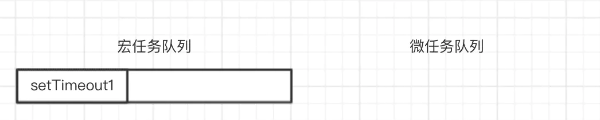

二，遇到第一个 Promise 任务源，此时会执行 Promise 第一个参数中的代码，即输出 promise1，然后将其指定的异步任务（then 中函数）放入微任务队列中；
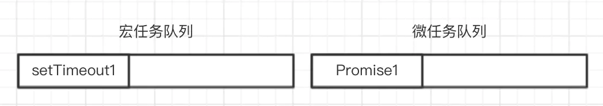

三，遇到 setImmediate 任务源，将其指定的异步任务放入宏任务队列中；
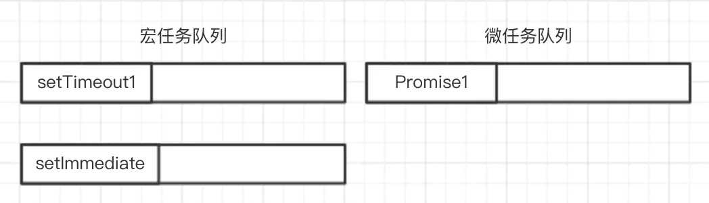
四，遇到 nextTick 任务源，将其指定的异步任务放入微任务队列中；
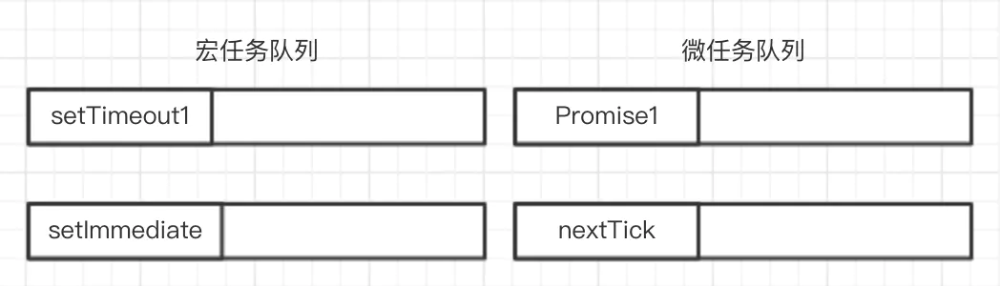
五，遇到第二个 Promise 任务源，输出 promise2，将其指定的异步任务放入微任务队列中；
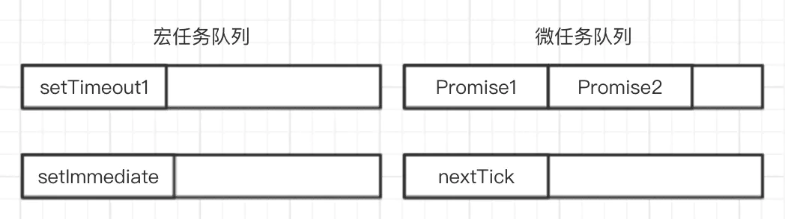
六，遇到第二个 setTimeout 任务源，将其指定的异步任务放入宏任务队列中；
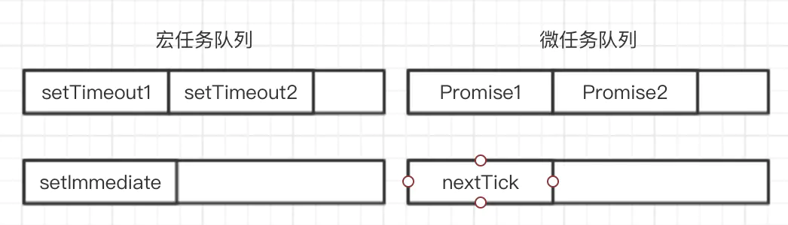
七，JavaScript 整体代码执行完毕，开始清空微任务队列，将微任务队列中的所有任务队列按优先级、单个任务队列的异步任务按先进先出的方式入栈并执行。此时我们可以看到微任务队列中存在 Promise 和 nextTick 队列，nextTick 队列优先级比较高，取出 nextTick 异步任务入栈执行，输出 nextTick；
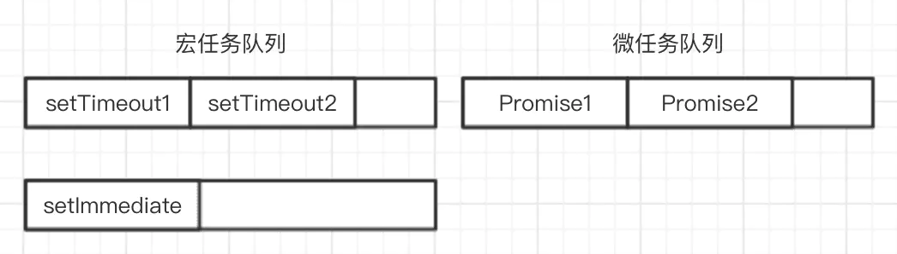
八，取出 Promise1 异步任务入栈执行，输出 promiseThen1；
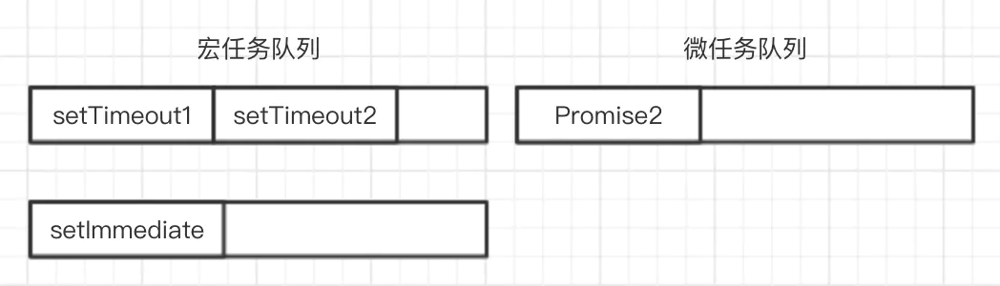
九，取出 Promise2 异步任务入栈执行，输出 promiseThen2；
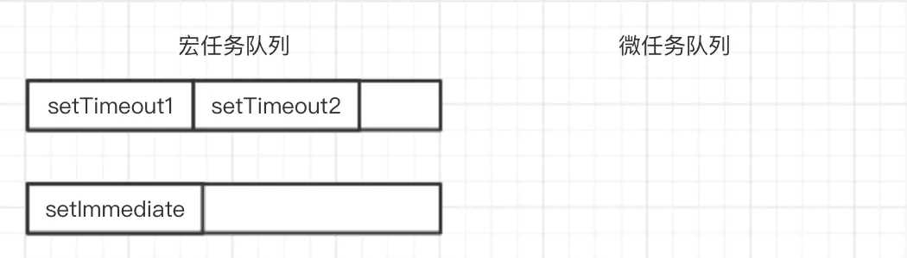
十，微任务队列清空完毕，执行宏任务队列，将宏任务队列中优先级最高的任务队列中的异步任务按先进先出的方式入栈并执行。此时我们可以看到宏任务队列中存在 setTimeout 和 setImmediate 队列，setTimeout 队列优先级比较高，取出 setTimeout1 异步任务入栈执行，输出 setTimeout1，遇到 Promise 和 nextTick 任务源，输出 setTimeout1_promise，将其指定的异步任务放入微任务队列中；
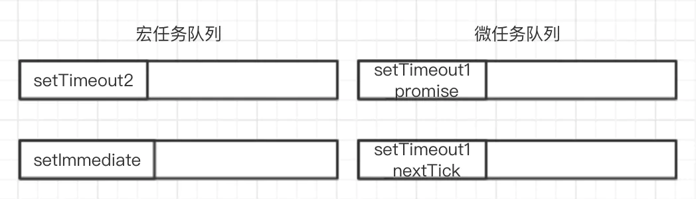
十一，取出 setTimeout2 异步任务入栈执行，输出 setTimeout2；
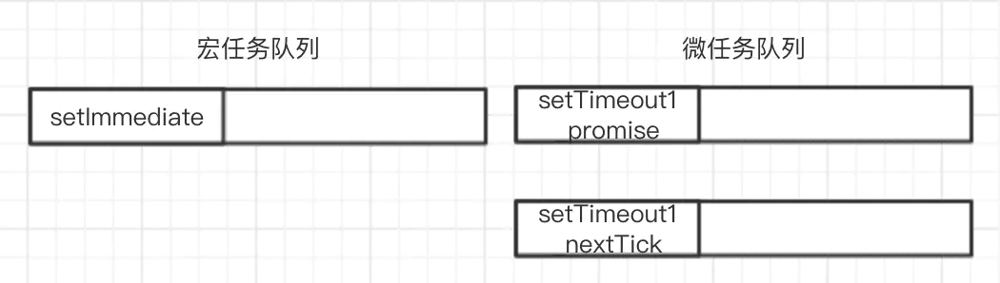
十二，至此一个微任务宏任务事件循环完毕，开始下一轮循环。从微任务队列中的 nextTick 队列取出 setTimeout1_nextTick 异步任务入栈执行，输出 setTimeout1_nextTick；
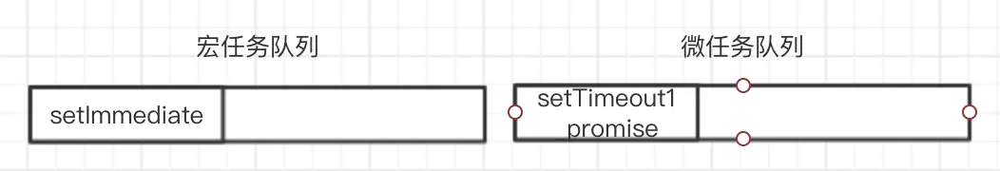
十三，从微任务队列中的 Promise 队列取出 setTimeout1_promise 异步任务入栈执行，输出 setTimeout1_promiseThen；

十四，从宏任务队列中的 setImmediate 队列取出 setImmediate 异步任务入栈执行，输出 setImmediate；

十五，全局上下文出栈，代码执行完毕。最终输出结果为

最后输出结果为：
```javascript
global
promise1
promise2
nextTick
promiseThen1
promiseThen2
setTimeout1
setTimeout1_promise
setTimeout1_nextTick
setTimeout1_promiseThen
setTimeout2
setImmediate
```
> 原文地址：https://juejin.cn/post/6844903634816204813